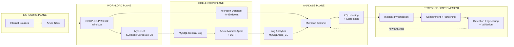

# Azure MySQL Honeypot — Detection Engineering & DFIR

> **Incident outcome:** An intentionally exposed Azure Windows/MySQL workload was compromised by external infrastructure. MySQL audit telemetry captured privileged access, database enumeration, destructive SQL, extortion artifacts, and a later cluster of high-impact administrative commands. I reconstructed the activity, contained and recovered the host, hardened the original attack path, then converted the observed behavior into Microsoft Sentinel detections and validated them against captured telemetry.

**Focus:** DFIR • Detection Engineering • Threat Hunting • Microsoft Sentinel • Defender for Endpoint • KQL • Azure • MySQL

> **Safety:** This lab used synthetic data in a controlled cyber-range environment. Indicators shown here are preserved for defensive analysis. No claim of data exfiltration is made unless telemetry supports it.

---

## Executive Summary

This project was built to answer a practical security question: **if an exposed database is compromised, can the attack be reconstructed well enough to drive better detections and hardening?**

The environment combined a Windows Azure VM, MySQL, Microsoft Defender for Endpoint (MDE), Azure Monitor Agent, Log Analytics, Microsoft Sentinel, and custom `MySQLAudit_CL` telemetry.

During controlled exposure, external hosts authenticated to MySQL as `root`. One high-confidence destructive session from **45.8.17.198** enumerated database objects, created an extortion-related artifact, and dropped tables in the synthetic corporate database. Later telemetry captured database deletion plus binary-log manipulation, privilege changes, and MySQL shutdown activity.

The response did not stop at finding the compromise. I preserved evidence, hunted across database and endpoint telemetry, isolated the device, removed the vulnerable configuration, restored the synthetic database, engineered new Sentinel analytics, tuned correlation logic, and validated the hardened environment.

### What the investigation established

| Finding | Evidence-backed conclusion |
|---|---|
| Privileged external MySQL access | Explicit `Connect root@<external IP>` records were captured |
| Destructive database activity | `DROP TABLE` / `DROP DATABASE` commands were logged |
| Extortion artifact | `RECOVER_YOUR_DATA` database/table and ransom message were observed |
| High-impact admin sequence | `RESET MASTER`, `PURGE BINARY LOGS`, privilege changes, and `SHUTDOWN` clustered within seconds |
| Host execution from MySQL | **Not observed** — hunting found no `mysqld.exe` child-process telemetry |
| Exfiltration | **Not proven** — the ransom message's backup/download claim is not evidence of data leaving the host |
| Recovery | Corporate schema restored and row counts validated |
| Detection improvement | Three behavior-based Sentinel detections were created/tuned from the incident |

---

## Architecture & Telemetry

Rather than treating the lab as a single VM feeding a SIEM, the project separates the environment into **exposure, workload, collection, analysis, and response planes**. This makes it easier to see where evidence originated and how it moved through the investigation.



### Telemetry Coverage Matrix

| Security question | Primary telemetry | What it established |
|---|---|---|
| Who attempted or obtained access? | MySQL general log / `MySQLAudit_CL`, `DeviceLogonEvents` | Explicit database users, source IPs, connection IDs, Windows logon activity |
| What happened after authentication? | `MySQLAudit_CL` | Enumeration, destructive SQL, extortion artifacts, administrative commands |
| Did activity extend into Windows execution? | MDE process telemetry | No observed `mysqld.exe` child-process execution |
| Was there supporting network activity? | `DeviceNetworkEvents` | Host network telemetry for scoping and correlation |
| How did the SIEM turn behavior into incidents? | Sentinel scheduled analytics | Authentication, destructive activity, high-impact admin activity |
| Did the hardened system retain visibility? | MDE + AMA/DCR + Sentinel | Security telemetry remained operational after remediation |

### Evidence Flow

```text
MySQL authentication / SQL
        │
        ▼
mysql_general.log
        │
        ▼
Azure Monitor Agent + DCR ──────► MySQLAudit_CL
                                      │
MDE endpoint telemetry ───────────────┤
                                      ▼
                              Microsoft Sentinel
                                      │
                       ┌──────────────┼──────────────┐
                       ▼              ▼              ▼
                    Hunting       Analytics       Incidents
                       │              │              │
                       └──────────────┴──────┬───────┘
                                             ▼
                                  DFIR / Detection Tuning
```

This architecture intentionally preserved **database-level telemetry alongside endpoint telemetry**. That distinction became critical: endpoint data helped scope the host, while MySQL query telemetry established the destructive actions performed after privileged database access.

---

## Incident Reconstruction

### 1. Initial access and authentication

External systems repeatedly attempted authentication against the exposed environment. MySQL audit records later showed explicit external `root` connections.

A parser caveat mattered here: a generic MySQL `Connect` event is **not automatically proof of compromise**. Strong attribution required an explicit `Connect user@IP` record and, where possible, subsequent query activity tied to the same connection.

### 2. Destructive session — ConnectionId 19

At approximately **2026-09-17 16:57:19 UTC**, MySQL recorded:

- `root@45.8.17.198` using SSL/TLS
- database/table enumeration
- creation of `corp_db_prod02.RECOVER_YOUR_DATA_info`
- insertion of an extortion-related artifact
- deletion of the synthetic corporate tables:
  - `orders`
  - `credentials`
  - `customers`
  - `payments`
- additional destructive activity against the `world` database
- session termination around **16:58:53 UTC**

The roughly 94-second sequence is consistent with automated destructive database-extortion behavior.

### 3. Later high-impact sequence

A later cluster included:

```text
DROP DATABASE ...
RESET MASTER
PURGE BINARY LOGS ...
REVOKE ALL PRIVILEGES, GRANT OPTION FROM root@'%'
GRANT SHUTDOWN ON *.* TO root@'%'
SHUTDOWN
```

The activity was valuable for detection engineering because the operations occurred across multiple connection IDs within a very short period.

### 4. Attribution discipline

The endpoint also contained known cyber-range simulation artifacts. Those were excluded from attacker attribution rather than mixed into the incident story.

A focused MDE hunt found **no evidence of `mysqld.exe` spawning Windows child processes**. Therefore the defensible compromise chain is:

**Internet → MySQL → privileged database access → destructive SQL/extortion activity**

—not unproven host-level code execution.

---

## Detection Engineering

The original monitoring emphasized authentication. The incident showed that the most damaging behavior occurred **after authentication**, so the post-incident work focused on behavioral detections.

### Detection 1 — MySQL Mass Destructive Database Activity

**Goal:** Detect bursts of destructive database operations from the same MySQL session.

**Logic:** Multiple `DROP TABLE` / `DROP DATABASE` operations in a five-minute window, enriched with temporally related authentication data.

**MITRE ATT&CK:** **Impact — T1485 Data Destruction**

The first version found **40 destructive SQL events**, but also included legitimate remediation activity. I tuned it by:

1. grouping by ConnectionId and five-minute windows;
2. requiring at least three destructive operations;
3. enriching with authentication context;
4. identifying a **ConnectionId reuse problem** that could cause stale IP attribution;
5. adding a 30-minute temporal correlation requirement.

Final historical validation correctly highlighted:

| Connection | User | Source | Destructive operations |
|---|---|---:|---:|
| 19 | root | 45.8.17.198 | 30 |
| 58 | root | 64.89.163.80 | 4 |

This tuning sequence is important: **raw detection → aggregation → enrichment → correlation bug discovered → temporal correction → validated attribution.**

> An early rule screenshot mapped this behavior to Data Encrypted for Impact. That mapping was corrected in the live rule to **T1485 Data Destruction** because the telemetry shows deletion/destruction, not encryption.

### Detection 2 — MySQL High-Impact Administrative Activity

**Goal:** Detect a cluster of distinct high-impact administrative operations.

Historical telemetry produced one high-confidence cluster:

- **5 suspicious operations**
- **5 distinct actions**
- Connection IDs **60–64**
- approximately **3 seconds** from first to last event

Actions included `RESET MASTER`, `PURGE BINARY LOGS`, privilege revocation, shutdown privilege assignment, and MySQL shutdown.

**MITRE ATT&CK:** T1485 is used in the incident context where the cluster accompanied destructive database activity; the individual administrative commands are retained as behavioral evidence rather than over-mapped to unsupported techniques.

### Detection 3 — External Privileged MySQL Authentication

**Goal:** Surface explicit external MySQL connections using the privileged `root` account.

The rule extracts:

- Username
- Source IP
- Connection ID
- First/last seen
- Connection count

Historical validation identified repeated privileged connections from multiple external addresses, including a high-volume source with **36 connections** in one aggregation window.

### Sentinel rule suite

The project retained the original authentication rules and added the three incident-derived analytics:

```text
HarryK - External Privileged MySQL Authentication
HarryK - MySQL Mass Destructive Database Activity
HarryK - MySQL High-Impact Administrative Activity
HarryK-SQL-Successful-Login
HarryK-success-logins
```

The destructive-database rule was also tested with a **controlled local test database**, generating four benign `DROP TABLE` operations. Sentinel ingested the events and generated the expected high-severity incident, validating the detection pipeline without re-exposing or re-ransoming the hardened host.

---

## DFIR Workflow

```text
Build
  ↓
Instrument
  ↓
Baseline
  ↓
Controlled Exposure
  ↓
Detect
  ↓
Hunt
  ↓
Reconstruct
  ↓
Contain
  ↓
Eradicate
  ↓
Recover
  ↓
Engineer Detections
  ↓
Validate
  ↓
Harden
```

### Evidence sources

- `MySQLAudit_CL`
- Defender `DeviceLogonEvents`
- Defender `DeviceNetworkEvents`
- Defender process/file telemetry
- Sentinel analytics and incidents
- MySQL Workbench validation
- Azure NSG configuration
- Windows Defender Firewall
- MDE investigation package

---

## Containment, Eradication & Recovery

### Containment

After confirming unauthorized privileged MySQL access and destructive database activity, the device was isolated through Microsoft Defender for Endpoint and the broad exposure was removed.

### Eradication

Remediation included:

- removing the dangerous allow-all inbound NSG rule;
- restoring Windows Defender Firewall;
- removing remote `root@'%'` access;
- retaining only `root@localhost`;
- removing the attacker-created ransom database after evidence preservation.

### Recovery

The synthetic corporate database was restored from the known-good build script and validated by row count:

| Table | Restored rows |
|---|---:|
| `credentials` | 372 |
| `customers` | 1,000 |
| `orders` | 1,963 |
| `payments` | 1,963 |

The objective was not simply to make MySQL run again; it was to demonstrate that the expected data structure returned after eradication.

---

## Before vs. After

| Control / condition | Exposure state | Hardened state |
|---|---|---|
| NSG | Broad inbound exposure | Default inbound deny / no custom allow-all |
| Windows Firewall | Disabled during controlled exposure | Domain, Private, Public profiles enabled |
| MySQL privileged remote access | `root@'%'` present | `root@localhost` only |
| Database state | Corporate tables destroyed; extortion artifact present | Synthetic corporate database restored and validated |
| Detection coverage | Primarily authentication-focused | Post-auth destructive/admin behavior + external privileged auth |
| Response | Manual investigation | Sentinel incident workflow; SOAR design attempted but cyber-range RBAC blocked Logic App deployment |

### SOAR limitation

A Sentinel/Logic Apps response playbook was designed for the high-severity destructive alert. Deployment was blocked by the cyber-range RBAC model because the student identity lacked `Microsoft.Logic/workflows/write` and `Microsoft.Web/connections/write`. I documented the limitation rather than representing an automation as deployed.

---

## Key Lessons Learned

1. **A successful login is only the beginning of the investigation.** Database query telemetry exposed the damaging post-authentication behavior.
2. **Detection tuning matters as much as detection creation.** ConnectionId reuse initially created stale attribution; time-bounded correlation corrected it.
3. **Do not let the ransom note write the incident report.** The note claimed backup/download behavior, but telemetry did not prove exfiltration.
4. **ATT&CK mappings should follow evidence.** Destructive SQL supported T1485 Data Destruction; encryption was not observed.
5. **Known lab activity must be separated from attacker activity.** Cyber-range simulation artifacts were excluded from external attacker attribution.
6. **High severity does not automatically justify automated containment.** Legitimate DBA activity can include destructive commands, so context and confidence still matter.
7. **The incident should improve the control plane.** Observed behaviors became new analytics and the vulnerable attack path was removed.

---

## Repository Structure

```text
.
├── README.md
├── detections/
│   ├── successful-vm-logon.kql
│   ├── successful-mysql-logon.kql
│   ├── mysql-mass-destructive-database-activity.kql
│   ├── mysql-high-impact-administrative-activity.kql
│   └── mysql-external-privileged-authentication.kql
├── hunting/
│   ├── pre-exposure-baseline.kql
│   └── pre-exposure-baseline-results.md
├── timeline/
│   └── attack-timeline.md
├── report/
│   └── incident-report.md
└── evidence/
    ├── pre-exposure/
    ├── attack/
    ├── containment/
    ├── remediation/
    ├── recovery/
    ├── detection-engineering/
    └── validation/
```

---

## Skills Demonstrated

**DFIR:** evidence preservation, timeline reconstruction, scoping, containment, eradication, recovery, evidence-backed conclusions  
**Detection Engineering:** KQL, rule tuning, temporal correlation, entity enrichment, historical validation, false-positive analysis  
**Microsoft Security:** Sentinel, Defender for Endpoint, Log Analytics, Azure Monitor Agent  
**Cloud / Network Security:** Azure NSGs, firewall hardening, attack-path reduction  
**Database Security:** MySQL authentication analysis, audit telemetry, destructive-query detection, privileged-access hardening  
**Threat Hunting:** authentication, process, network, and database telemetry correlation

---

## Disclaimer

This project was performed in an authorized cyber-range/lab using synthetic data for defensive security research and portfolio development. External indicators are documented only as observed telemetry. No offensive activity was directed at third-party systems.
