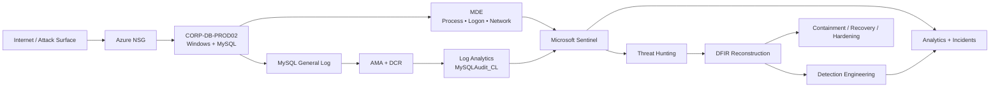

# Azure MySQL Honeypot — DFIR & Detection Engineering

> **Real attack telemetry → destructive database extortion → DFIR → tuned Sentinel detections → hardened recovery**

During a controlled cyber-range exposure, external infrastructure gained privileged MySQL access to an Azure Windows workload. Custom telemetry captured destructive SQL, an extortion artifact demanding cryptocurrency, database deletion, and a rapid cluster of high-impact administrative commands.

I used the compromise as a **detection-engineering feedback loop**: reconstruct the attack, contain and recover the system, identify visibility gaps, engineer new Sentinel analytics from the observed behavior, tune correlation logic, and validate the hardened environment.

**Stack:** Microsoft Sentinel • Defender for Endpoint • Azure • Log Analytics • AMA/DCR • KQL • MySQL

### Incident at a Glance

| | Evidence-backed result |
|---|---|
| **Compromise** | External privileged MySQL `root` sessions captured |
| **Impact** | `DROP TABLE` / `DROP DATABASE` destroyed synthetic corporate data |
| **Extortion** | `RECOVER_YOUR_DATA` artifact demanded cryptocurrency |
| **Detection** | 3 incident-derived Sentinel analytics engineered and validated |
| **Recovery** | Corporate schema restored and row counts verified |
| **Hardening** | Broad NSG exposure removed, firewall restored, remote `root@'%'` eliminated |

> The ransom note claimed the data had been backed up/downloaded. Telemetry did **not** prove exfiltration, so I do not claim it occurred.

---

## Vulnerable vs. Hardened Security Outcomes

The project was designed as a controlled **before-and-after security experiment**: expose the vulnerable Azure/MySQL workload, measure the resulting activity and compromise, harden the same system, then measure the hardened environment.

| Security Metric | 🔴 Vulnerable Exposure | 🟢 Hardened Exposure | Outcome |
|---|---:|---:|---|
| **Failed Windows logons** | Attack activity observed during exposure* | **0** in captured hardened validation window | Reduced |
| **Successful Windows logons** | Successful remote logon activity observed* | **0** in captured hardened validation window | Reduced |
| **External privileged MySQL access** | Multiple external `root@IP` sessions observed | **0 expected by design; remote `root@'%'` removed** | Remote root eliminated |
| **Destructive SQL operations** | **40** identified during incident hunt | **0 uncontrolled** | Destructive path removed |
| **High-impact MySQL admin actions** | **5 actions in ~3 sec** | **0 observed** | Destructive admin sequence absent |
| **Database destruction** | **Yes** — corporate tables/database destroyed | **No** during hardened validation | Prevented in validation |
| **Allow-all inbound NSG** | **Enabled** | **Removed** | Attack surface reduced |
| **Windows Firewall** | **Disabled** | **Domain / Private / Public enabled** | Host firewall restored |
| **MySQL remote root** | `root@'%'` **enabled** | `root@localhost` **only** | Privileged remote access removed |
| **Corporate data state** | Tables destroyed during extortion activity | **Restored:** 372 credentials, 1,000 customers, 1,963 orders, 1,963 payments | Data recovered |
| **Detection coverage** | Primarily authentication-focused | **+3 behavior-based Sentinel analytics** | Post-auth visibility added |
| **Hardened telemetry health** | — | **117 network events / 12 MySQL events** captured | Monitoring remained operational |

> **Measurement note:** Hardened counts describe the captured post-hardening validation window. The exact vulnerable-exposure Windows failed/successful logon totals are intentionally not substituted with pre-exposure baseline counts. They should only be added when verified from the vulnerable-exposure measurement window.

**Result:** the vulnerable configuration permitted privileged external database access and destructive extortion activity. After containment, recovery, and hardening, the captured validation window showed **zero Windows logons, no uncontrolled destructive SQL, remote MySQL root access removed, and telemetry/detection coverage still operating**.


---

## Architecture & Telemetry

The architecture was built around **evidence flow**, not simply a VM feeding a SIEM.



| Telemetry | What it proved |
|---|---|
| **`MySQLAudit_CL`** | Source IP, user, ConnectionId, enumeration, destructive SQL, extortion artifacts, admin commands |
| **MDE** | Windows logons, processes, files, network activity, host scoping |
| **Sentinel** | Cross-source hunting, analytics, incidents, validation |
| **Azure controls** | Vulnerable exposure and post-incident hardening |

**Authentication telemetry showed access occurred. Database telemetry showed what the attacker actually did after access.**

---

## Destructive Database Extortion

At approximately **2026-09-17 16:57:19 UTC**, `root@45.8.17.198` established an SSL/TLS MySQL session as **ConnectionId 19**. Within roughly **94 seconds**, the session enumerated database objects, created an extortion artifact, inserted a cryptocurrency ransom message, and dropped the synthetic corporate tables `orders`, `credentials`, `customers`, and `payments`.

Later telemetry captured database deletion followed by:

```text
RESET MASTER
PURGE BINARY LOGS ...
REVOKE ALL PRIVILEGES, GRANT OPTION FROM root@'%'
GRANT SHUTDOWN ON *.* TO root@'%'
SHUTDOWN
```

This supports **MITRE ATT&CK T1485 — Data Destruction**. Encryption was not observed.

### High-value evidence

**Ransom/extortion artifact:** `10-post-attack-ransom-note.png`

A focused MDE hunt found **no `mysqld.exe` child-process execution**, keeping the defensible compromise chain to:

**Internet → privileged MySQL access → destructive SQL → database extortion**

---

## Detection Engineering

The original monitoring emphasized authentication. DFIR showed that the highest-impact behavior occurred **after authentication**, creating a detection gap. I converted the attack into three behavioral analytics.

### Detection 1 — MySQL Mass Destructive Database Activity

The first hunt returned **40 destructive SQL events**. The production logic was tuned to aggregate by ConnectionId in five-minute windows, require **3+ destructive operations**, and enrich the session with authentication context.

Historical validation isolated:

| Connection | User | Source IP | Operations |
|---|---|---|---:|
| 19 | root | 45.8.17.198 | 30 |
| 58 | root | 64.89.163.80 | 4 |

#### Detection tuning that mattered

MySQL **reuses ConnectionIds**. Initial enrichment could therefore associate later legitimate activity with an older attacker IP. I corrected this by requiring authentication to occur **before the destructive activity and within 30 minutes**.

**Raw events → session aggregation → auth enrichment → ConnectionId reuse discovered → temporal correlation → validated attribution**

That is the core engineering lesson: **a rule that fires but attributes the wrong source is not a finished detection.**

### Detection 2 — MySQL High-Impact Administrative Activity

Detects clusters of `RESET MASTER`, `PURGE BINARY LOGS`, privilege changes, and `SHUTDOWN`. Historical validation found **5 distinct high-impact actions across ConnectionIds 60–64 in approximately 3 seconds**.

### Detection 3 — External Privileged MySQL Authentication

Detects explicit external `root` sessions and aggregates them by source IP. Historical validation identified repeated privileged connections, including a source producing **36 connections** in one aggregation window.

### Sentinel rule suite

The project retained the original authentication rules and added the three incident-derived analytics:

```text
HarryK - External Privileged MySQL Authentication
HarryK - MySQL Mass Destructive Database Activity
HarryK - MySQL High-Impact Administrative Activity
HarryK-SQL-Successful-Login
HarryK-success-logins
```

The destructive rule was then safely validated using a disposable local database and four controlled `DROP TABLE` operations.

**Workbench → MySQL log → AMA/DCR → `MySQLAudit_CL` → Sentinel analytics → High-severity incident**

The observed test-to-incident interval was approximately **9 minutes**, including ingestion, scheduled-rule execution, and Sentinel processing. This is a validation measurement—not a universal MTTD claim.

**Final detection suite:** `evidence-detection-engineering07-sentinel-final-detection-suite.png`

The KQL is preserved in the `detections/` directory so the engineering can be reviewed directly.

---

## Containment, Recovery & Hardening

After confirming destructive activity, I:

- isolated the host through **Microsoft Defender for Endpoint**;
- removed the broad allow-all NSG exposure;
- restored **Windows Defender Firewall**;
- preserved and then removed the attacker-created ransom database;
- removed remote `root@'%'` and retained `root@localhost`;
- restored `corp_db_prod02` from the known-good synthetic-data script;
- validated the recovered data.

| Restored table | Rows |
|---|---:|
| `credentials` | 372 |
| `customers` | 1,000 |
| `orders` | 1,963 |
| `payments` | 1,963 |

**Recovery evidence:** `evidence-recovery02-restored-data-validation.png`

---

## Before vs. After

| Control / condition | Exposure state | Hardened state |
|---|---|---|
| NSG | Broad inbound exposure | Default inbound deny / no custom allow-all |
| Windows Firewall | Disabled during controlled exposure | Domain, Private, Public profiles enabled |
| MySQL privileged remote access | `root@'%'` present | `root@localhost` only |
| Database state | Corporate tables destroyed; extortion artifact present | Synthetic corporate database restored and validated |
| Detection coverage | Primarily authentication-focused | Post-auth destructive/admin behavior + external privileged auth |
| Response | Manual investigation | Sentinel incident workflow; SOAR design attempted but cyber-range RBAC blocked Logic App deployment |

---


## What This Project Demonstrates

**DFIR:** evidence preservation, scoping, reconstruction, containment, eradication, recovery  
**Detection Engineering:** KQL, behavioral analytics, temporal correlation, tuning, false-positive analysis, validation  
**Telemetry Engineering:** MySQL logs → AMA/DCR → Log Analytics → Sentinel  
**Threat Hunting:** authentication, database, endpoint, process, and network correlation  
**Azure Security:** NSG hardening, Defender for Endpoint, Sentinel, Log Analytics

Detailed evidence remains in the repository, with the full chronology in `timeline/attack-timeline.md` and formal findings in `report/incident-report.md`.

### Lessons that changed the detection strategy

- **Access is not impact.** Authentication alerts did not explain what happened after compromise; SQL telemetry did.
- **Telemetry quality drives DFIR quality.** Custom database logging made the destructive sequence reconstructable.
- **Detection tuning is engineering.** ConnectionId reuse required temporal correlation, not another keyword.
- **Ransom notes are attacker claims, not evidence.** The cryptocurrency/extortion artifact was real; exfiltration was not proven.
- **Incidents should improve controls.** Observed attacker behavior became new detections and the original attack path was hardened.

---

## Skills Demonstrated

**DFIR:** evidence preservation, timeline reconstruction, scoping, containment, eradication, recovery, evidence-backed conclusions  
**Detection Engineering:** KQL, rule tuning, temporal correlation, entity enrichment, historical validation, false-positive analysis  
**Microsoft Security:** Sentinel, Defender for Endpoint, Log Analytics, Azure Monitor Agent  
**Cloud / Network Security:** Azure NSGs, firewall hardening, attack-path reduction  
**Database Security:** MySQL authentication analysis, audit telemetry, destructive-query detection, privileged-access hardening  
**Threat Hunting:** authentication, process, network, and database telemetry correlation

---

## Disclaimer

This project was performed in an authorized cyber-range/lab using synthetic data for defensive security research and portfolio development. External indicators are documented only as observed telemetry. No offensive activity was directed at third-party systems.
